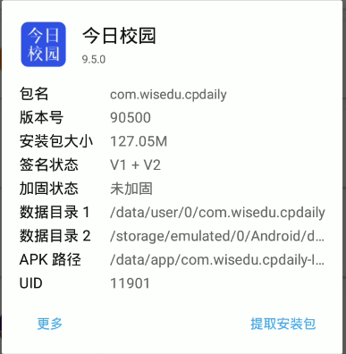
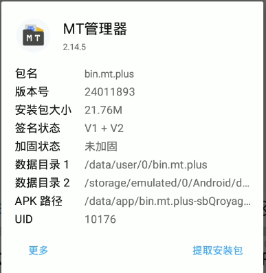
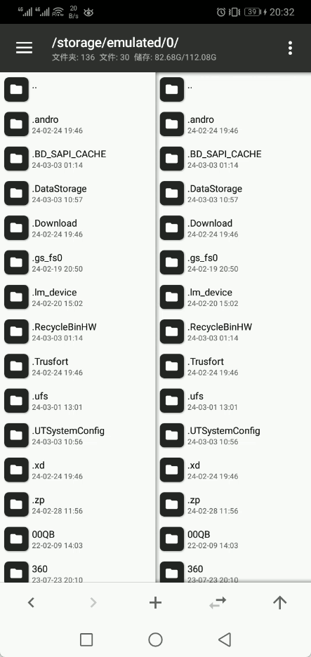

# Today's Campus - Check-in Script

### Tested Schools

- ~~Chongqing City Management Vocational College~~
    

### Running the Script

- Parameter Description
    ```python
    {  
        # Required,  
        "userId": "",  # Student ID
        "deviceId": "",  # Device ID
        "sessionToken": "",  # Obtained token
        "MOD_AUTH_CAS": "",  # Identity info
        # Optional  
        "server_url": "", # Server URL
        "schoolCode": "", # School code, default is 12758
    }
    ```
- Run|
  Save `jrxy_sign.py` locally, fill in the required parameters, and run it.
    ```shell
    python jrxy_sign.py
    ```
  

### Obtaining Script Parameters

#### Without Root

1. Download the MT Manager and the "Today's Campus" app from the Releases section on the right, and install them.

   
   
   

2. Log in to your account in the newly installed Today's Campus app.
3. After logging in, open MT Manager, click the three-line menu icon in the top left to open the sidebar, then click the three dots in the top right and select "Add Local Storage". Click the three-line menu icon in the top left again to open the sidebar, select Today's Campus, and then click the "Select" button at the bottom of the screen.

   
   
5. Click the newly added local storage, then click the `data` folder, enter the `shared_prefs` folder, and find these two files: `BUGLY_COMMON_VALUES.xml` and `private-cookies.xml`. You can find `deviceId` in the first file, and `sessionToken` and `MOD_AUTH_CAS` in the second file.

   


#### With Root

1. Install MT Manager and Today's Campus (no restrictions), and log in to your account.
2. Open the sidebar, click "Extract App", select the Today's Campus app, click "Data Directory 1", enter the `shared_prefs` folder, and find these two files: `BUGLY_COMMON_VALUES.xml` and `private-cookies.xml`. You can find `deviceId` in the first file, and `sessionToken` and `MOD_AUTH_CAS` in the second file.

   


### Self-Hosted Server

1. Download the server application from the `Release` section on the right. There are versions for Windows and Linux (choose according to your system).
2. Run the Script
   - Script parameters, help can be obtained via `-h`
        ```shell
          -h -help   
               Get help 
               Get help
          -host string
               Set the host address (default "0.0.0.0")
               Set the host address, default value is "0.0.0.0"
          -path string
               Set the route address (default "/jrxy")
               Set the request route, default value is "/jrxy"
          -port int
               Set the port number (default 10001)
               Set the request port, default value is 10001
          -v -version
               Get the version number
               Get version information
        ```

   - Windows
     Run by default, just double-click it

   - Linux
        ```shell
        chmod 777 jrxy-server-linux
        ./jrxy-server-linux
        ```
