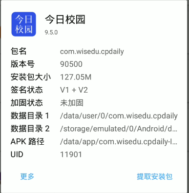
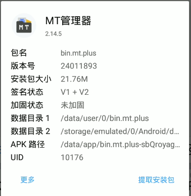
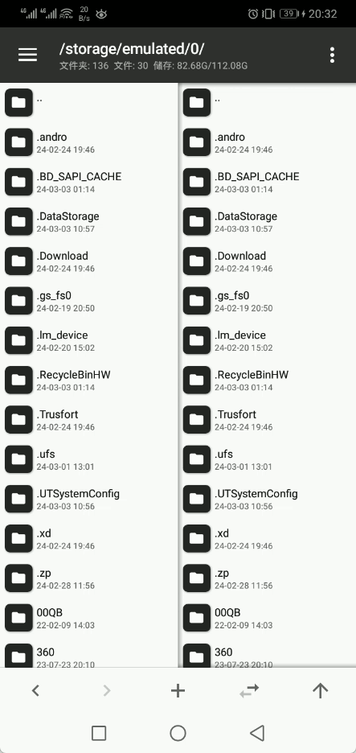

# 今日校园-签到脚本


### 测试学校

    - 重庆城市管理职业学院
    

### 运行脚本

- 参数介绍
    ```python
    {  
        # 必填项,  
        "userId": "",  # 学号
        "deviceId": "",  # 设备Id
        "sessionToken": "",  # 获取token
        "MOD_AUTH_CAS": "",  # 身份信息
        # 选填项  
        "server_url": "", # 服务器地址
        "schoolCode": "", # 学校code, 默认为12758
    }
    ```
- 运行|
  将`jrxy_sign.py`保存到本地，将所需的参数填上，即可运行。
    ```shell
    python jrxy_sign.py
    ```
  

### 获取代码运行参数

#### 无root版

1. 下载MT管理器及右边Releases中的今日校园安装好。

   
   
   

2. 在新安装的这个今日校园中登录你的账号。
3. 登录好之后，打开MT管理器，点击左上角三条横线的位置，打开侧边栏，在点击右上角的三个点选择“添加本地存储”，再次点击左上角三条横线的位置，打开侧边栏，选中今日校园，在点击屏幕下方的“选择”按钮。

   
   
5. 点击刚才新添加到的本地存储，在点击`data`文件夹，在进入`shared_prefs`文件夹，在里面找到这两个`BUGLY_COMMON_VALUES.xml`, `private-cookies.xml`,在第一个文件中可以找到`deviceId`,第二个文件中可以找到`sessionToken`、`MOD_AUTH_CAS`这两个值。

   


#### root版

1. 安装MT管理器和今日校园(不限制),登录好账号。
2. 打开侧边栏，点击提取安装包，点击今日校园app，点击"数据目录1"，进入`shared_prefs`文件夹，在里面找到这两个`BUGLY_COMMON_VALUES.xml`, `private-cookies.xml`,在第一个文件中可以找到`deviceId`,第二个文件中可以找到`sessionToken`、`MOD_AUTH_CAS`这两个值。

   


### 自建服务端

1. 从右边的的`Release`下载服务端的应用程序，有Windows版和Linux版(根据自己的系统下载)
2. 运行脚本
   - 脚本参数，可通过`-h`获取帮助
        ```shell
          -h -help   
                Get help 
                获取帮助
          -host string
                Set the host address (default "0.0.0.0")
                设置主机地址，默认值为"0.0.0.0"
          -path string
                Set the route address (default "/jrxy")
                设置请求路由，默认值为"/jrxy"
          -port int
                Set the port number (default 10001)
                设置请求端口，默认值为10001
          -v -version
                Get the version number
                获取版本信息
        ```

   - Windows
     默认运行，直接双击即可

   - Linux
        ```shell
        chmod 777 jrxy-server-linux
        ./jrxy-server-linux
        ```
