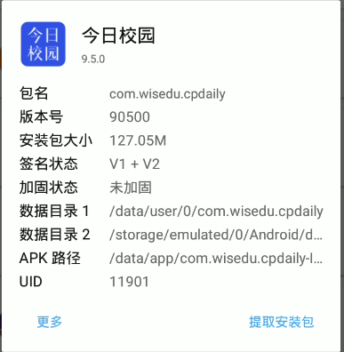
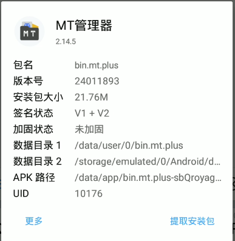
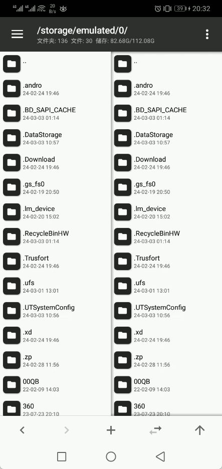

### 运行脚本

- 参数介绍
```python
{  
    # 必填项,  
    "userId": "",  # 学号
    "deviceId": "",  # 设备Id
    "sessionToken": "",  # 获取token
    "MOD_AUTH_CAS": "",  # 身份信息
    # 选填项  
    "server_url": "", # 服务器地址
    "schoolCode": "", # 学校code, 默认为12758
}
```
- 运行|
  将`jrxy_sign.py`保存到本地，将所需的参数填上，即可运行。
```shell
python jrxy_sign.py
```
  

### 获取代码运行参数

#### 无root版

1. 下载MT管理器及右边Releases中的今日校园安装好。
   
   

2. 在新安装的这个今日校园中登录你的账号。
3. 登录好之后，打开MT管理器，点击左上角三条横线的位置，打开侧边栏，在点击右上角的三个点选择“添加本地存储”，再次点击左上角三条横线的位置，打开侧边栏，选中今日校园，在点击屏幕下方的“选择”按钮。
   
4. 点击刚才新添加到的本地存储，在点击`data`文件夹，在进入`shared_prefs`文件夹，在里面找到这两个`BUGLY_COMMON_VALUES.xml`, `private-cookies.xml`,在第一个文件中可以找到`deviceId`,第二个文件中可以找到`sessionToken`、`MOD_AUTH_CAS`这两个值。
   


#### root版

1. 安装MT管理器和今日校园(不限制),登录好账号。
2. 打开侧边栏，点击提取安装包，点击今日校园app，点击"数据目录1"，进入`shared_prefs`文件夹，在里面找到这两个`BUGLY_COMMON_VALUES.xml`, `private-cookies.xml`,在第一个文件中可以找到`deviceId`,第二个文件中可以找到`sessionToken`、`MOD_AUTH_CAS`这两个值。
   


### 自建服务端

1. 从右边的的`Release`下载服务端的应用程序，有Windows版和Linux版(根据自己的系统下载)
2. 运行脚本
   - 脚本参数，可通过`-h`获取帮助
```shell
  -h -help   
        Get help 
        获取帮助
  -host string
        Set the host address (default "0.0.0.0")
        设置主机地址，默认值为"0.0.0.0"
  -path string
        Set the route address (default "/jrxy")
        设置请求路由，默认值为"/jrxy"
  -port int
        Set the port number (default 10001)
        设置请求端口，默认值为10001
  -v -version
        Get the version number
        获取版本信息
```

   - Windows
     默认运行，直接双击即可

   - Linux
```shell
chmod 777 jrxy-server-linux
./jrxy-server-linux
```
